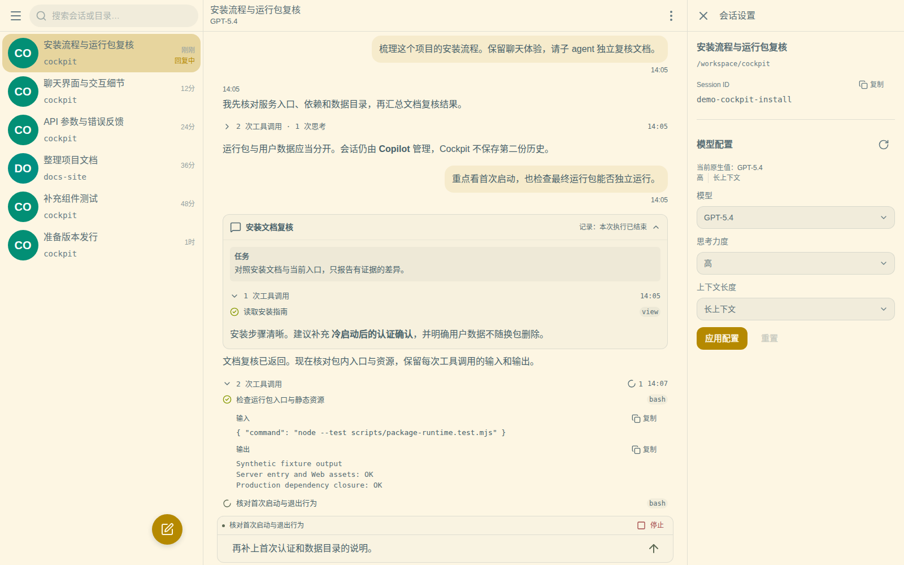
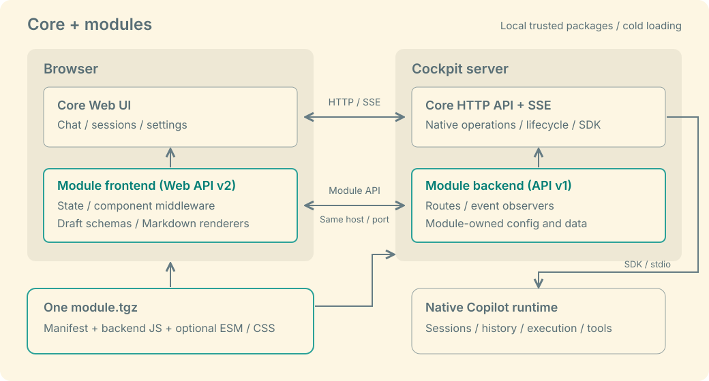

# Cockpit

Cockpit 是 Copilot 的 Web 界面和 API 服务，由**本体 + 扩展模块**组成。
本体提供会话、聊天和原生配置；文件、通知等功能由模块按需添加。
扩展不限定在一份内置功能清单里：你可以安装已有模块，也可以通过公开的前后端接口开发自己的模块。

[安装](docs/DEPLOY-PORTABLE.md) · [现有扩展](#现有扩展) · [开发扩展](docs/module-contract-draft.md) · [全部文档](docs/README.md)

## 本体

在浏览器里选择项目目录、新建或继续会话，阅读回复，展开工具调用、思考和子 Agent 的执行过程。
执行中可以追加排队消息、停止工作，或回答 Agent 提出的问题。
会话设置提供模型、思考力度和上下文长度配置，MCP 与 Skills 分别管理。



*左侧切换会话，中间查看消息与执行过程，右侧调整当前会话的模型配置。*


*Agent 需要补充信息时，可以直接选择答案，也可以输入自己的回答。两张截图均由真实界面组件与合成数据生成，不含私人会话。*

本体通过官方 SDK 使用 Copilot，会话、历史和执行状态仍由 Copilot 管理。
Web 和 API 使用同一个服务；其他 Agent 可以通过随包提供的 [stdio MCP 客户端](apps/mcp/README.md)
访问同一后端。HTTP/MCP 与 Web 的入口不完全相同，完整接口由 `/capabilities` 提供。

## 扩展如何工作

一个模块是带有 `cockpit.module.json` 的本地 `.tgz` 包，可以同时包含后端 JavaScript
和前端 ESM/CSS。模块单独发行、按需安装，不随本体默认启用。

| 扩展位置 | 能做什么 | 如何接入 |
| --- | --- | --- |
| 前端 | 增强输入区、消息、会话状态；向已有全局/会话菜单添加动作，扩展草稿、链接与图片的呈现。 | 共用本体 React 和主题，通过菜单声明、组件 middleware、state 服务/草稿 schema 与 Markdown 渲染注册接入。 |
| 后端 | 提供模块 HTTP 接口、观察原生事件，管理配置和业务数据，向自己的前端发送数据事件。 | 在本体 Node 进程中加载，使用模块独立的路由命名空间和数据目录，沿用同一个服务端口与 SSE 连接。 |



例如，文件模块在输入区加入选文件、粘贴和拖放，在后端处理上传与下载；
发送消息仍走本体的原生接口。通知模块在消息和会话列表上显示未读状态，
在自己的后端与浏览器 worker 中处理推送。

模块只采用**可信本地包、冷加载**：安装、版本选择、启用或停用在下次冷启动时生效。
不做热加载、热启停或热更新，也不为此预留框架或改变可信主进程加载模型。
模块代码没有沙箱隔离，接入范围以当前公开接口为准；远程 URL 安装、通用页面注册和逐模块 HTTP MCP 尚未提供。
Cockpit 模块与 Copilot 的 MCP、Skills、plugins 是不同的扩展机制。

包格式、安装命令和前后端接口见[模块接入协议](docs/module-contract-draft.md)；
样式、图标与可运行示例见[模块 UI 开发指南](docs/module-ui-guide.md)。

## 现有扩展

| 项目 | 用途 | 当前接入状态 |
| --- | --- | --- |
| [Cockpit File](https://github.com/waksana/cockpit-file) | 聊天上传与附件、文件下载、图片和媒体预览。 | 已有可安装模块。 |
| [Cockpit Notification](https://github.com/waksana/cockpit-notification) | 新回复与待回答问题的未读标记、会话计数，以及受设备支持限制的推送和角标。 | 已有可安装模块。 |
| [Cockpit Task](https://github.com/waksana/cockpit-task) | 结构化任务、授权派单和执行者报告。 | 已有独立发布包，待适配当前模块体系。 |
| [Cockpit WeChat Connector](https://github.com/waksana/cockpit-wechat-connector) | 将授权微信私信用户连接到指定会话，收发文本及支持的媒体。 | 已有独立发布包，待适配当前模块体系。 |

模块与宿主需要配套版本，安装入口与限制见[模块目录](docs/module-catalog.md)。
Task 和微信连接器的 ZIP 包不能直接用当前模块安装器安装。
语音、会话整理等后续方向也在目录中单列，不作为已发布功能。

## 安装与运行

按[安装指南](docs/DEPLOY-PORTABLE.md)下载运行包、准备 Copilot 登录并启动服务。
当前运行包支持 **Linux x64 / glibc、Node 24.20.0**；Web 默认地址为 `http://127.0.0.1:8771`。

也可以把下面这段话交给 Agent：

```text
请从 https://github.com/waksana/cockpit/releases/latest 确定最新已发布的 Cockpit 版本，
阅读该 tag 下的 docs/DEPLOY-PORTABLE.md，按文档在这台机器上安装并启动。

同时阅读现有模块目录：https://github.com/waksana/cockpit/blob/main/docs/module-catalog.md。
开始安装前，逐个介绍现有模块的用途、主要限制，以及是否兼容所选宿主版本。
对每个可安装模块分别询问我是否安装，一次只问一个；可以全部不安装。
尚未适配的项目只作介绍，不作为可安装选项。只安装我明确选择的模块，并使用配套的已发布版本。

下载该版本的运行包和校验文件，不混用不同版本的文件或模块。
如果已经有运行中的安装，请先告诉我，不要直接覆盖或停止。
需要登录时引导我在本机完成，不要让我把令牌发到聊天里。
完成后给我访问地址，并说明哪些模块已安装、哪些已实际加载，以及是否还需要配置或授权。
```

Cockpit 面向可信机器上的单个操作者，不提供多用户隔离或内置网页登录。
原生工具权限为 `allow-all`；远程访问必须配置认证 HTTPS 入口，不能直接暴露未认证端口。
具体要求见[安装指南](docs/DEPLOY-PORTABLE.md#remote-access)与[安全政策](SECURITY.md)。

[文档](docs/README.md) · [发行说明](https://github.com/waksana/cockpit/releases) · [反馈问题](https://github.com/waksana/cockpit/issues/new/choose) · [参与贡献](CONTRIBUTING.md)

本项目使用 [GPL-3.0-only](LICENSE)；第三方来源与署名见 [NOTICE](NOTICE.md)。
